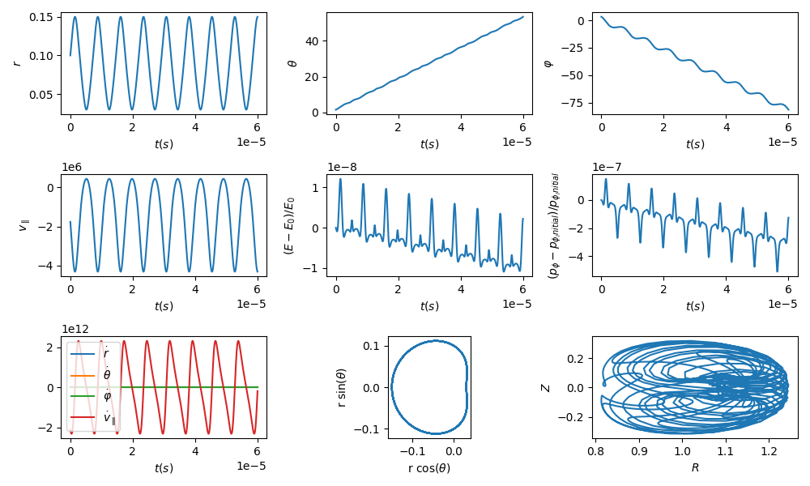
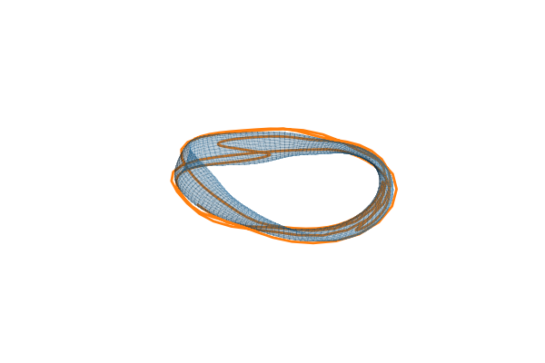

Example: Plot Single Particle
*****************************

.. literalinclude :: ../../examples/plot_single_orbit_qs.py

   Figure 1: Parameters of a particle orbit calculated with the example in ``examples/plot_single_orbit_qs.py``

.. figure:: _static/assets/plot_single_orbit_qs_2.png
   :width: 700px
   :alt: plot_single_orbit_qs_2.png
   :align: center

   Figure 2: Particle orbits in 3D calculated with the example in ``examples/plot_single_orbit_qs.py``

   Figure 3: Example of an animation with the orbit calculated with the example in ``examples/plot_single_orbit_qs.py``